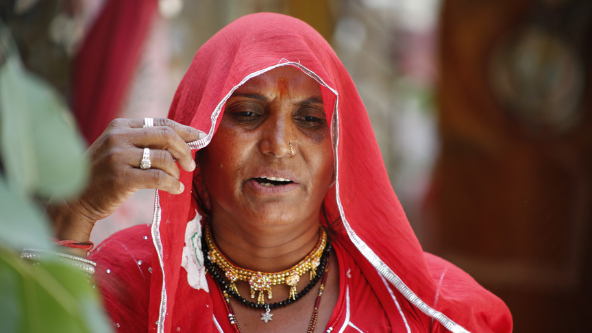

# Bhanwari Devi



Bhanwari Devi is an oppressed-caste woman who dared to fight against the feudal, casteist and patriarchal structures of rural Rajasthan. She started as a social worker as part of the government-run Women’s Development Project. In 1992, she became involved in specific campaigns against child marriage. She counselled women on family planning, girl child education, against female foeticide, dowry, and child marriage. Already, as a result of her activism, she and her family were subjected to constant threats and intimidation by the dominant caste men in the village.

Once she intervened to stop the marriage of a nine-month-old infant from a dominant caste family. This enraged the dominant caste men in the village. Despite knowing the consequences that were likely, she dared to continue to defy them and stand for what was right. The same year, in an act of retaliation, she was gang-raped and her husband beat-up while working on the field.

In her subsequent pursuit for justice, every step along the way she faced intense hurdles. At the police station, at the primary health care centre, and the judiciary. Read more about her [here](https://medium.com/@dalithistorynow/dalit-history-month-2019-celebrating-bhanwari-devi-c4bd47d7126e).

# React - Redux with Material-UI

### Node Version: 11.10.1

Global Installs
```
  npm install -g webpack@latest
```

Download and install the dependenices:
```
  npm install
```

Run the dev-server by running the command
```
  npm run dev
```
